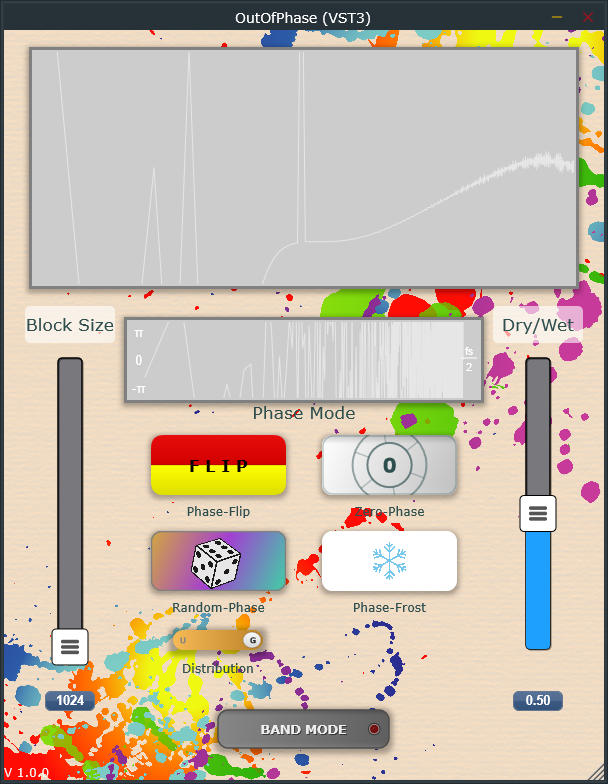

# OutOfPhase Audio Plugin

A phase manipulation plugin for audio processing.
Uses the [Advanced Audio Template](https://github.com/JoergBitzer/AdvancedAudioTemplate) by J. Bitzer and the FFT-Algorithm by U. Simmer.

## Core Functionality

- **Phase Operations**: Provides phase freeze, flip, random phase and zero phase modes
- **Frequency Band Processing**: Process specific frequency ranges independently

## Technical Details

- FFT-based phase processing
- Separate low and high frequency boundary control
- Minimal CPU usage with optimized processing

## System Compatibility

- Formats: VST3, AU, AAX
- OS: Windows 10+ or macOS 10.13+ (64-bit)

## Development Information

Built with JUCE framework.